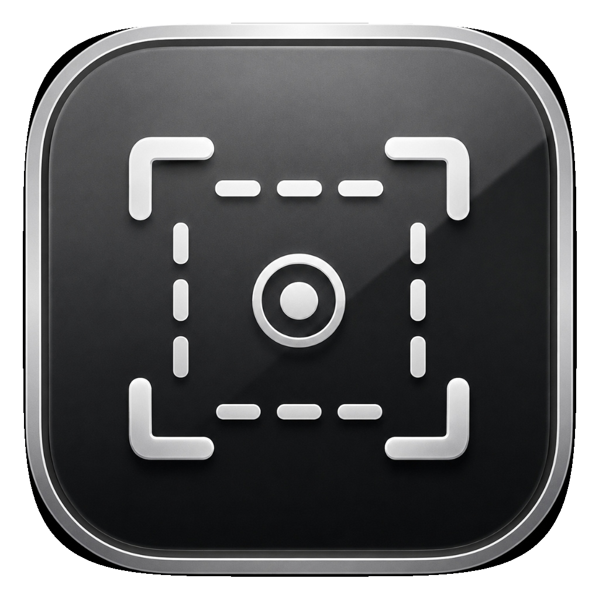

# MacSnip

<p align="center">
  
</p>

<p align="center">
  <strong>MacSnip</strong> — 轻量、强大的 macOS 截图翻译工具
</p>

<p align="center">
  
  
  
  
</p>

---

## ✨ 功能特性

| 功能 | 说明 |
|:---|:---|
| 🖼️ **截图识别（OCR）** | 截取任意区域，自动识别图中文字 |
| 🌐 **AI 翻译** | 对接主流大模型 API，一键翻译截图内容 |
| 🖊️ **标注工具栏** | 支持矩形、箭头、画笔、荧光笔、文字等丰富标注工具 |
| 📌 **图钉悬浮** | 截图后可钉在屏幕上，随时参考 |
| 📜 **历史记录** | 自动保存历史截图，支持自定义存储路径 |
| ⌨️ **自定义快捷键** | 全局热键可自由绑定，默认 `⌘ + ⇧ + A` |
| 🤖 **多模型支持** | 内置 DeepSeek、GLM、Qwen、OpenAI、Claude、Kimi 等主流大模型模板 |
| 🔑 **安全存储** | API Key 保存在系统 Keychain，不明文落盘 |

---

## 📸 截图预览

> 截图、标注、翻译一气呵成

<!-- 可以替换为实际截图 -->
<!--  -->

---

## 🚀 快速开始

### 方法一：直接下载（推荐）

1. 前往 [Releases](../../releases) 页面
2. 下载最新版 `MacSnip-v1.1.0-macOS-arm64.zip`
3. 解压后将 `MacSnip.app` 拖入 `/Applications` 文件夹
4. 首次运行需在 **系统设置 → 隐私与安全性 → 屏幕录制** 中授权 MacSnip

### 方法二：从源码编译

**环境要求**
- macOS 13.0+
- Xcode Command Line Tools（`xcode-select --install`）
- Swift 5.9+

```bash
# 克隆仓库
git clone https://github.com/zuoruchun/MacSnip.git
cd MacSnip

# 编译并安装到 /Applications
chmod +x scripts/build_app.sh
./scripts/build_app.sh
```

编译完成后 `MacSnip.app` 会自动安装到 `/Applications`。

---

## ⚙️ 首次配置

### 1. 授权屏幕录制权限

打开后若无法截图，请前往：

**系统设置 → 隐私与安全性 → 屏幕录制** → 开启 MacSnip

> 若设置后仍无效，重启 MacSnip 即可。

### 2. 配置 AI 翻译

点击菜单栏图标 → **偏好设置** → **AI 翻译配置**：

| 供应商 | 模型 | 获取 API Key |
|:---|:---|:---|
| DeepSeek | `deepseek-v4-flash` | [platform.deepseek.com](https://platform.deepseek.com) |
| 智谱 GLM | `glm-4.7-flash`（免费） | [open.bigmodel.cn](https://open.bigmodel.cn) |
| 通义千问 | `qwen3.7-flash` | [dashscope.console.aliyun.com](https://dashscope.console.aliyun.com) |
| OpenAI | `gpt-5.6-luna` | [platform.openai.com](https://platform.openai.com) |
| Claude | `claude-haiku-4-5-20251001` | [console.anthropic.com](https://console.anthropic.com) |
| Kimi | `moonshot-v1-8k` | [platform.moonshot.cn](https://platform.moonshot.cn) |

填入 Base URL 和 API Key 后，点击 **测试连接** 验证是否正常。

### 3. 设置快捷键（可选）

**偏好设置 → 通用偏好 → 全局截图快捷键**

点击按钮后，直接按下目标组合键即可实时绑定，默认为 `⌘ + ⇧ + A`。

---

## 🎯 使用方式

1. **触发截图**：按下全局快捷键 `⌘ + ⇧ + A`（或自定义键）
2. **框选区域**：鼠标拖动选择截图区域，松手后进入标注模式
3. **标注内容**（可选）：使用工具栏中的矩形、箭头、画笔、文字等工具
4. **完成截图**：点击 ✓ 确认，截图保存到历史记录
5. **OCR 识别**：在标注界面点击 **识别文字** 提取文本
6. **AI 翻译**：点击 **翻译** 按钮，使用配置的大模型翻译识别内容
7. **图钉悬浮**：点击 📌 将截图悬浮在屏幕上方便参考

---

## 📁 历史记录

历史截图默认保存在：

```
~/Library/Application Support/MacSnip/history/
```

可在 **偏好设置 → 通用偏好 → 历史记录存储位置** 中更改路径，并设置自动清理天数。

---

## 🔧 项目结构

```
MacSnip/
├── Sources/MacSnip/
│   ├── App/               # AppDelegate、入口
│   ├── API/               # LLM 接口配置与调用
│   ├── Managers/          # 截图、历史、设置、权限等管理器
│   └── UI/                # 所有 SwiftUI 界面
│       ├── Settings/      # 偏好设置
│       ├── Capture/       # 截图标注工具栏
│       └── History/       # 历史记录界面
├── scripts/
│   ├── build_app.sh       # 一键编译 + 打包 + 安装脚本
│   └── AppIcon.icns       # 应用图标
└── Package.swift
```

---

## 📄 License

MIT License © 2026 [nocasdom](https://github.com/zuoruchun)

---

<p align="center">Made with ❤️ by nocasdom</p>
